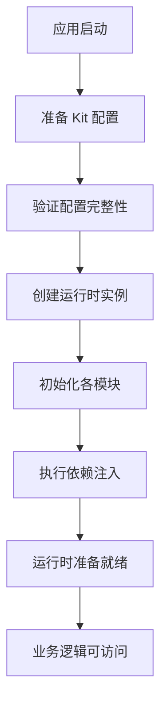

# 运行时初始化

本章详细介绍 NucleusX-Core 运行时的初始化过程和最佳实践。

## 初始化流程

NucleusX-Core 的初始化遵循严格的顺序，确保各模块正确配置。

### 标准初始化流程



### 代码实现

```typescript
import { createRuntime } from '@nucleusx/core';

async function initializeApplication() {
  // 1. 准备 Kit 配置
  const kit = {
    // 平台桥接器
    platformBridge: createPlatformBridge(),
    
    // 状态管理引擎
    storeEngine: createStoreEngine(),
    
    // 请求配置
    request: {
      baseUrl: 'https://api.example.com',
      adapter: createRequestAdapter()
    },
    
    // 路由配置
    router: {
      mode: 'auto',
      pagesFetcher: () => fetchPages(),
      userPermissionsProvider: () => getUserPermissions(),
      appConfig: { startPage: 'home' }
    },
    
    // 日志配置
    logger: {
      level: 'info',
      transports: [new ConsoleTransport()]
    }
  };
  
  // 2. 验证配置（可选但推荐）
  validateKitConfiguration(kit);
  
  try {
    // 3. 创建运行时实例
    const runtime = await createRuntime(kit);
    
    // 4. 验证运行时状态
    verifyRuntimeHealth(runtime);
    
    console.log('NucleusX Runtime initialized successfully');
    return runtime;
  } catch (error) {
    console.error('Failed to initialize NucleusX Runtime:', error);
    throw error;
  }
}
```

## Kit 配置最佳实践

### 完整的 Kit 配置示例

```typescript
import { createRuntime, type IKit } from '@nucleusx/core';
import { ConsoleTransport, StorageTransport } from './transports';
import { createWxAdapter } from './adapters';
import { createMobxEngine } from './engines';

const createKit = async (): Promise<IKit> => {
  // 异步获取必要配置
  const [pagesConfig, userPermissions] = await Promise.all([
    fetchPagesConfig(),
    fetchUserPermissions()
  ]);
  
  return {
    platformBridge: {
      // 平台桥接器实现
      showToast: (options) => wx.showToast(options),
      showLoading: (options) => wx.showLoading(options),
      hideLoading: () => wx.hideLoading(),
      showModal: (options) => wx.showModal(options),
      getStorageSync: (key) => wx.getStorageSync(key),
      setStorageSync: (key, data) => wx.setStorageSync(key, data),
      removeStorageSync: (key) => wx.removeStorageSync(key),
      clearStorageSync: () => wx.clearStorageSync(),
      getSystemInfo: () => wx.getSystemInfoSync(),
      navigateTo: (options) => wx.navigateTo(options),
      redirectTo: (options) => wx.redirectTo(options),
      navigateBack: (options) => wx.navigateBack(options),
    },
    storeEngine: createMobxEngine(),
    request: {
      baseUrl: process.env.API_BASE_URL || 'https://api.example.com',
      adapter: createWxAdapter(),
      timeout: 10000,
      headers: {
        'Content-Type': 'application/json',
        'X-App-Version': process.env.APP_VERSION || '1.0.0',
        'X-Client-Type': 'mini-program'
      },
      isBizSuccess: (response) => {
        return response.statusCode === 200 && 
               response.data && 
               (response.data.code === 0 || response.data.code === 200);
      },
      errorMode: 'wrapped'
    },
    router: {
      mode: 'auto',
      pagesFetcher: () => Promise.resolve(pagesConfig),
      userPermissionsProvider: () => userPermissions,
      appConfig: { 
        startPage: 'home',
        defaultTransition: 'slide'
      },
      animation: {
        duration: 300,
        easing: 'ease-in-out',
        enabled: true,
        type: 'slide'
      }
    },
    logger: {
      level: process.env.NODE_ENV === 'production' ? 'warn' : 'debug',
      transports: [
        new ConsoleTransport(),
        new StorageTransport({ maxEntries: 2000 })
      ],
      defaultContext: 'MyApp'
    },
    appInfo: {
      appId: process.env.APP_ID || 'default-app-id',
      name: 'My Application',
      version: process.env.APP_VERSION || '1.0.0',
    }
  };
};
```

## 模块初始化详解

### 1. 平台桥接器初始化

平台桥接器是连接 NucleusX-Core 与具体平台的桥梁。

```typescript
// 平台桥接器工厂函数
const createPlatformBridge = (): IPlatformBridge => {
  return {
    showToast: (options) => {
      // 添加通用处理逻辑
      console.log('[Toast]', options.title || options.content);
      wx.showToast(options);
    },
    showLoading: (options) => {
      console.log('[Loading]', options.title);
      wx.showLoading(options);
    },
    // ... 其他实现
  };
};
```

### 2. 请求模块初始化

请求模块需要先初始化适配器。

```typescript
// 请求适配器初始化
const createRequestAdapter = (): RequestAdapter => {
  return {
    request: (config) => {
      return new Promise((resolve, reject) => {
        wx.request({
          url: config.url,
          method: config.method || 'GET',
          data: config.data,
          header: {
            ...config.headers,
            'X-Requested-With': 'NucleusX-Core'
          },
          success: (res) => {
            console.log('[Request Success]', config.url, res);
            resolve(res);
          },
          fail: (err) => {
            console.error('[Request Failed]', config.url, err);
            reject(err);
          }
        });
      });
    }
  };
};

// 请求模块配置
const createRequestConfig = (adapter: RequestAdapter) => {
  return {
    baseUrl: process.env.API_BASE_URL || 'https://api.example.com',
    adapter,
    timeout: parseInt(process.env.REQUEST_TIMEOUT || '10000'),
    headers: {
      'Content-Type': 'application/json',
      'User-Agent': `NucleusX/${process.env.APP_VERSION || '1.0.0'}`
    },
    isBizSuccess: (response) => {
      // 自定义业务成功判断
      return response.statusCode === 200 && 
             response.data && 
             response.data.code === 0;
    },
    errorMode: 'wrapped' as const
  };
};
```

### 3. 路由模块初始化

路由模块需要异步获取页面配置。

```typescript
// 页面配置获取
const fetchPagesConfig = async (): Promise<PageRoute[]> => {
  try {
    const response = await fetch('/api/pages-config');
    return response.json();
  } catch (error) {
    console.error('Failed to fetch pages config:', error);
    // 返回默认配置
    return getDefaultPagesConfig();
  }
};

// 权限提供者
const getUserPermissions = (): UserPermission[] => {
  const permissions = wx.getStorageSync('user_permissions');
  return permissions || [];
};
```

### 4. 日志模块初始化

日志模块根据环境配置不同输出策略。

```typescript
// 日志传输器工厂
const createLogTransports = () => {
  const transports = [];
  
  // 开发环境始终输出到控制台
  if (process.env.NODE_ENV === 'development') {
    transports.push(new ConsoleTransport());
  }
  
  // 生产环境存储到本地
  if (process.env.NODE_ENV === 'production') {
    transports.push(new StorageTransport({ 
      maxEntries: 2000,
      storageKey: 'app_logs'
    }));
  }
  
  // 根据配置决定是否上报到服务器
  if (process.env.LOG_SERVER_ENABLED) {
    transports.push(new HttpTransport({
      endpoint: process.env.LOG_SERVER_ENDPOINT || 'https://logs.example.com/api/logs',
      batchSize: 10
    }));
  }
  
  return transports;
};
```

## 错误处理与容错

### 初始化错误处理

```typescript
// 初始化错误处理
const handleInitializationError = (error: Error) => {
  console.error('Runtime initialization failed:', error);
  
  // 记录错误日志
  const fallbackLogger = new ConsoleTransport();
  fallbackLogger.log({
    level: 'error',
    time: new Date(),
    context: 'Runtime',
    message: 'Initialization failed',
    meta: { error: error.message, stack: error.stack }
  });
  
  // 尝试降级处理
  if (error.message.includes('Network Error')) {
    // 网络错误处理
    showNetworkErrorAlert();
  } else if (error.message.includes('Storage')) {
    // 存储错误处理
    clearStorageAndRetry();
  }
  
  // 抛出错误，阻止应用继续运行
  throw error;
};
```

### 运行时健康检查

```typescript
// 运行时健康检查
const verifyRuntimeHealth = (runtime: IRuntime) => {
  // 检查必需模块是否存在
  if (!runtime.request) {
    throw new Error('Request module not available');
  }
  
  if (!runtime.router) {
    throw new Error('Router module not available');
  }
  
  if (!runtime.logger) {
    throw new Error('Logger module not available');
  }
  
  // 简单的功能测试
  try {
    // 测试日志功能
    runtime.logger.info('Runtime health check passed');
    
    // 测试路由功能（如果已初始化）
    if (typeof runtime.router.getCurrentRoute === 'function') {
      runtime.router.getCurrentRoute();
    }
  } catch (error) {
    console.warn('Runtime health check partially failed:', error);
    // 非致命错误，记录但继续运行
  }
};
```

## 配置验证

### Kit 配置验证

```typescript
// Kit 配置验证函数
const validateKitConfiguration = (kit: IKit): void => {
  // 验证必需字段
  if (!kit.platformBridge) {
    throw new Error('platformBridge is required in Kit configuration');
  }
  
  if (!kit.storeEngine) {
    throw new Error('storeEngine is required in Kit configuration');
  }
  
  // 验证请求配置
  if (!kit.request) {
    throw new Error('request configuration is required');
  }
  
  if (!kit.request.adapter) {
    throw new Error('request.adapter is required');
  }
  
  if (!kit.request.baseUrl) {
    throw new Error('request.baseUrl is required');
  }
  
  // 验证路由配置
  if (!kit.router) {
    throw new Error('router configuration is required');
  }
  
  if (!kit.router.pagesFetcher) {
    throw new Error('router.pagesFetcher is required');
  }
  
  if (!kit.router.userPermissionsProvider) {
    throw new Error('router.userPermissionsProvider is required');
  }
  
  // 验证日志配置
  if (!kit.logger) {
    throw new Error('logger configuration is required');
  }
  
  if (!kit.logger.transports || kit.logger.transports.length === 0) {
    throw new Error('logger.transports is required and cannot be empty');
  }
  
  console.log('Kit configuration validation passed');
};
```

## 环境特定初始化

### 不同环境的初始化策略

```typescript
// 环境特定初始化
const initializeForEnvironment = async () => {
  switch (process.env.NODE_ENV) {
    case 'development':
      return await initializeDevelopment();
    case 'staging':
      return await initializeStaging();
    case 'production':
      return await initializeProduction();
    default:
      return await initializeDevelopment();
  }
};

const initializeDevelopment = async () => {
  console.log('Initializing for development environment');
  
  const kit = await createKit();
  
  // 开发环境特殊配置
  kit.logger.level = 'debug';
  kit.request.timeout = 30000; // 更长的超时时间
  
  return await createRuntime(kit);
};

const initializeProduction = async () => {
  console.log('Initializing for production environment');
  
  const kit = await createKit();
  
  // 生产环境特殊配置
  kit.logger.level = 'warn';
  kit.request.timeout = 10000;
  
  return await createRuntime(kit);
};
```

## 启动优化

### 异步初始化优化

```typescript
// 优化的异步初始化
class OptimizedInitializer {
  private cache: Map<string, any> = new Map();
  
  async initialize() {
    // 并行加载非依赖性资源
    const [basicConfig, userConfig] = await Promise.all([
      this.loadBasicConfig(),
      this.loadUserConfig()
    ]);
    
    // 使用缓存的配置
    this.cache.set('basicConfig', basicConfig);
    this.cache.set('userConfig', userConfig);
    
    // 创建 Kit 配置
    const kit = await this.createOptimizedKit(basicConfig, userConfig);
    
    // 初始化运行时
    const runtime = await createRuntime(kit);
    
    // 预热常用模块
    await this.preheatModules(runtime);
    
    return runtime;
  }
  
  private async preheatModules(runtime: IRuntime) {
    // 预热常用功能
    setTimeout(() => {
      // 预加载常用页面信息
      if (runtime.router) {
        runtime.router.preloadRouteData('home');
      }
      
      // 预连接常用 API
      if (runtime.request) {
        // 发送预热请求
        runtime.request.get('/api/ping').catch(() => {
          // 忽略预热错误
        });
      }
    }, 1000);
  }
}
```

通过遵循这些初始化最佳实践，您可以确保 NucleusX-Core 运行时的稳定性和性能。